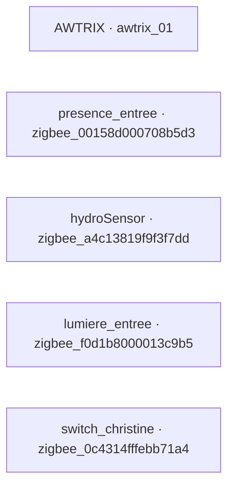
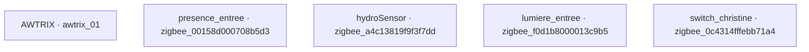

# Camera orientable

Juste un test de liaisons d'esp32

Export : 2026-09-27T11:02:39.906Z. Un seul projet Patchwork est actif à la fois.

## Contenu

- `project.json` : nœuds présents sur le plan, contrats MQTT, conversions, liaisons entre ces nœuds, disposition et adaptateurs.
- `esphome/` : configurations des ESP32 et dépendances locales (YAML, packages, en-têtes C++ et documentation disponible).
- `restore-project.cjs` : restauration dans une installation Patchwork avec gestion des projets.
- Les données de mesure et les secrets locaux ne sont pas nécessaires à l’export.

Sur GitHub, ces fichiers et ce README se trouvent dans **camera-orientable/**, dans le dépôt **pi-vert/Patchwork**. Exécuter les commandes ci-dessous depuis ce dossier (ou depuis la racine de l’archive téléchargée).

## Matériel et services

| Nœud | Nom | Type | Source / adaptateur |
| --- | --- | --- | --- |
| awtrix_01 | AWTRIX | awtrix | awtrix |
| zigbee_00158d000708b5d3 | presence_entree | zigbee | Zigbee2MQTT : zigbee2mqtt/presence_entree |
| zigbee_a4c13819f9f3f7dd | hydroSensor | zigbee | Zigbee2MQTT : zigbee2mqtt/hydroSensor |
| zigbee_f0d1b8000013c9b5 | lumiere_entree | zigbee | Zigbee2MQTT : zigbee2mqtt/lumiere_entree |
| zigbee_0c4314fffebb71a4 | switch_christine | zigbee | Zigbee2MQTT : zigbee2mqtt/switch_christine |

Les fichiers YAML indiquent la carte ESP32, les GPIO et les composants utilisés. Les fiches disponibles sont dans `esphome/docs/`. Respecter les tensions et le câblage documentés pour chaque appareil.

## Installation des ESP32

Ce projet utilise uniquement des services/adaptateurs : aucun firmware ESP32 à compiler.

## Restaurer et utiliser le projet

1. Installer une version de Patchwork prenant en charge les projets, puis la démarrer une fois. Configurer son broker MQTT sur le même réseau que les appareils.
2. Arrêter Node-RED. Depuis le dossier contenant `project.json`, lancer :

```bash
node restore-project.cjs /chemin/vers/patchwork/data/patchwork.json
```

Le script sauvegarde le fichier existant et ajoute une copie inactive du projet avec de nouveaux identifiants. Les autres projets restent présents. Les appareils déjà connus gardent leur contrat local.

3. Redémarrer Node-RED, ouvrir Patchwork et choisir **Camera orientable** dans **Projet actif**. Cela remplace le projet précédemment actif.
4. Cliquer sur **Découvrir les nœuds** ; attendre leur présence en ligne. Les identifiants MQTT doivent correspondre à ceux du tableau.
5. Vérifier les nœuds présents sur le plan, les ports et les conversions. Les nœuds mis de côté sont exclus de l’export. Une sortie verte à droite se relie à une entrée orange à gauche. Une liaison en pause peut être activée depuis la liste.
6. Faire varier les capteurs : les nouvelles valeurs alimentent les destinations du diagramme. Les anciennes valeurs retained ne sont jamais rejouées à l’activation.
7. Pour arrêter le routage, sélectionner **Aucun projet actif**. Cette action ne remet pas les actionneurs à zéro : ils gardent leur dernier état matériel.

Les adaptateurs AWTRIX/météo sont décrits dans `project.json` (préfixe MQTT, coordonnées). Pour Zigbee, la passerelle Zigbee2MQTT doit publier son catalogue et ses mesures sur le broker configuré ; l’appairage radio se fait dans Zigbee2MQTT.

## Diagramme des liaisons

Traits pointillés : liaisons en pause. Les nœuds isolés présents sur le plan sont également inclus.



## Diagramme de flux

Chaque bloc intermédiaire indique la conversion appliquée. Le moteur vérifie aussi le type, les bornes, la fraîcheur et la disponibilité avant publication MQTT non retained.



## Paramètres des liaisons

| Source | Destination | Conversion | Clé de regroupement | État |
| --- | --- | --- | --- | --- |
| — | — | Aucune liaison configurée | — | — |

Les entrées JSON décomposées utilisent des ports logiques (`__`) et sont assemblées en un message sur le topic du parent. Une entrée `keyed` rassemble les valeurs fraîches par clé ; `single` accepte une seule liaison active ; `latest` retient la dernière valeur.

## Contrats MQTT

| Nœud | Direction | Port | Type | Unité | Plage | Topic |
| --- | --- | --- | --- | --- | --- | --- |
| awtrix_01 | Entrée | text | string |  | — → — | device/awtrix_01/actuator/text/set |
| awtrix_01 | Entrée | weather | json |  | — → — | device/awtrix_01/actuator/weather/set |
| zigbee_00158d000708b5d3 | Sortie | occupancy | bool |  | — → — | device/zigbee_00158d000708b5d3/sensor/occupancy/state |
| zigbee_00158d000708b5d3 | Sortie | illuminance | float | lx | — → — | device/zigbee_00158d000708b5d3/sensor/illuminance/state |
| zigbee_a4c13819f9f3f7dd | Sortie | dry | bool |  | — → — | device/zigbee_a4c13819f9f3f7dd/sensor/dry/state |
| zigbee_a4c13819f9f3f7dd | Sortie | temperature | float | °C | — → — | device/zigbee_a4c13819f9f3f7dd/sensor/temperature/state |
| zigbee_a4c13819f9f3f7dd | Sortie | humidity | float | % | — → — | device/zigbee_a4c13819f9f3f7dd/sensor/humidity/state |
| zigbee_a4c13819f9f3f7dd | Sortie | soil_moisture | float | % | — → — | device/zigbee_a4c13819f9f3f7dd/sensor/soil_moisture/state |
| zigbee_a4c13819f9f3f7dd | Sortie | temperature_unit | string |  | — → — | device/zigbee_a4c13819f9f3f7dd/sensor/temperature_unit/state |
| zigbee_a4c13819f9f3f7dd | Sortie | temperature_calibration | float | °C | -2 → 2 | device/zigbee_a4c13819f9f3f7dd/sensor/temperature_calibration/state |
| zigbee_a4c13819f9f3f7dd | Sortie | humidity_calibration | float | % | -30 → 30 | device/zigbee_a4c13819f9f3f7dd/sensor/humidity_calibration/state |
| zigbee_a4c13819f9f3f7dd | Sortie | soil_calibration | float | % | -30 → 30 | device/zigbee_a4c13819f9f3f7dd/sensor/soil_calibration/state |
| zigbee_a4c13819f9f3f7dd | Sortie | temperature_sampling | float | s | 5 → 3600 | device/zigbee_a4c13819f9f3f7dd/sensor/temperature_sampling/state |
| zigbee_a4c13819f9f3f7dd | Sortie | soil_sampling | float | s | 5 → 3600 | device/zigbee_a4c13819f9f3f7dd/sensor/soil_sampling/state |
| zigbee_a4c13819f9f3f7dd | Sortie | soil_warning | float | % | 0 → 100 | device/zigbee_a4c13819f9f3f7dd/sensor/soil_warning/state |
| zigbee_a4c13819f9f3f7dd | Entrée | temperature_unit | string |  | — → — | device/zigbee_a4c13819f9f3f7dd/actuator/temperature_unit/set |
| zigbee_a4c13819f9f3f7dd | Entrée | temperature_calibration | float | °C | -2 → 2 | device/zigbee_a4c13819f9f3f7dd/actuator/temperature_calibration/set |
| zigbee_a4c13819f9f3f7dd | Entrée | humidity_calibration | float | % | -30 → 30 | device/zigbee_a4c13819f9f3f7dd/actuator/humidity_calibration/set |
| zigbee_a4c13819f9f3f7dd | Entrée | soil_calibration | float | % | -30 → 30 | device/zigbee_a4c13819f9f3f7dd/actuator/soil_calibration/set |
| zigbee_a4c13819f9f3f7dd | Entrée | temperature_sampling | float | s | 5 → 3600 | device/zigbee_a4c13819f9f3f7dd/actuator/temperature_sampling/set |
| zigbee_a4c13819f9f3f7dd | Entrée | soil_sampling | float | s | 5 → 3600 | device/zigbee_a4c13819f9f3f7dd/actuator/soil_sampling/set |
| zigbee_a4c13819f9f3f7dd | Entrée | soil_warning | float | % | 0 → 100 | device/zigbee_a4c13819f9f3f7dd/actuator/soil_warning/set |
| zigbee_a4c13819f9f3f7dd | Entrée | identify | string |  | — → — | device/zigbee_a4c13819f9f3f7dd/actuator/identify/set |
| zigbee_f0d1b8000013c9b5 | Sortie | state | bool |  | — → — | device/zigbee_f0d1b8000013c9b5/sensor/state/state |
| zigbee_f0d1b8000013c9b5 | Sortie | brightness | float |  | 0 → 254 | device/zigbee_f0d1b8000013c9b5/sensor/brightness/state |
| zigbee_f0d1b8000013c9b5 | Sortie | color_temp | float | mired | 153 → 370 | device/zigbee_f0d1b8000013c9b5/sensor/color_temp/state |
| zigbee_f0d1b8000013c9b5 | Entrée | state | bool |  | — → — | device/zigbee_f0d1b8000013c9b5/actuator/state/set |
| zigbee_f0d1b8000013c9b5 | Entrée | brightness | float |  | 0 → 254 | device/zigbee_f0d1b8000013c9b5/actuator/brightness/set |
| zigbee_f0d1b8000013c9b5 | Entrée | color_temp | float | mired | 153 → 370 | device/zigbee_f0d1b8000013c9b5/actuator/color_temp/set |
| zigbee_f0d1b8000013c9b5 | Entrée | effect | string |  | — → — | device/zigbee_f0d1b8000013c9b5/actuator/effect/set |
| zigbee_0c4314fffebb71a4 | Sortie | state | bool |  | — → — | device/zigbee_0c4314fffebb71a4/sensor/state/state |
| zigbee_0c4314fffebb71a4 | Entrée | state | bool |  | — → — | device/zigbee_0c4314fffebb71a4/actuator/state/set |

Découverte : `system/discover` (`announce`, non retained). Annonces : `device/<id>/announce`. Les disponibilités, schémas JSON, pas et valeurs possibles figurent dans `project.json`.

## Vérifications et dépannage

- Nœud absent : vérifier alimentation, Wi-Fi, adresse du broker, identifiants et abonnement aux annonces.
- Destination hors ligne : attendre une annonce fraîche ou un heartbeat ; un ancien statut retained ne prouve pas sa présence.
- Liaison sans effet : vérifier le projet actif, la pause, les plages/types et le journal Patchwork. Les cycles sont refusés.
- Assemblage JSON en attente : fournir tous les champs raccordés et les propriétés requises par le schéma.
- Pour enregistrer le plan : déplacer les cartes, mettre de côté les nœuds à exclure, puis **Enregistrer le plan**. Le téléchargement et la publication enregistrent aussi automatiquement ce plan.

## Publier les modifications

Dans Patchwork, le dépôt commun est **pi-vert/Patchwork**. Le dossier **camera-orientable/** est propre à ce projet ; il est indiqué dans **Modifier le projet**. Sur le serveur, connecter GitHub CLI avec `gh auth login` (accès en écriture au contenu et permission de création si nécessaire). Puis **Exporter / GitHub → Envoyer sur GitHub**. Un dépôt absent est créé privé. La publication actualise atomiquement uniquement le dossier du projet sur la branche par défaut ; les autres projets et le README racine sont conservés. Une modification distante concurrente demande de réessayer. Un dossier appartenant à un autre projet est refusé : choisir un autre dossier dans les paramètres. Changer de dossier laisse l’ancienne publication en place.
